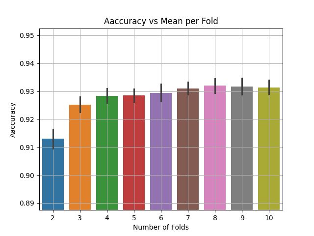
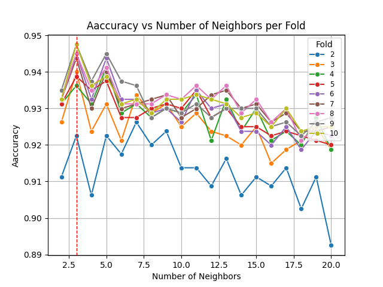

# plhpro_final

  
  

A knn algorithm using sklearn lib to make predictions on some past campaign data  
Above you can see some plots from the tuning process for the best **n** number of neighbors 

> **Note:**
> Project is not complete yet (missing GUI)  
